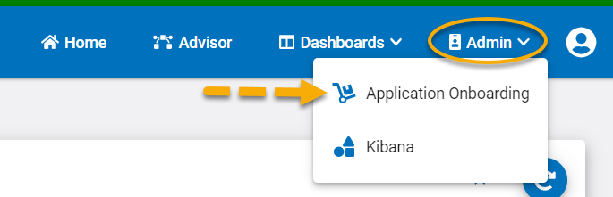
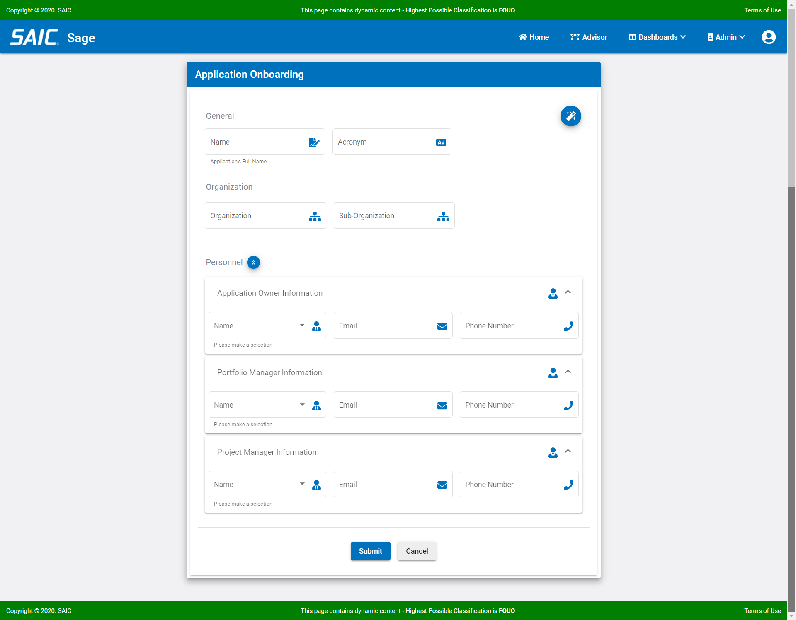
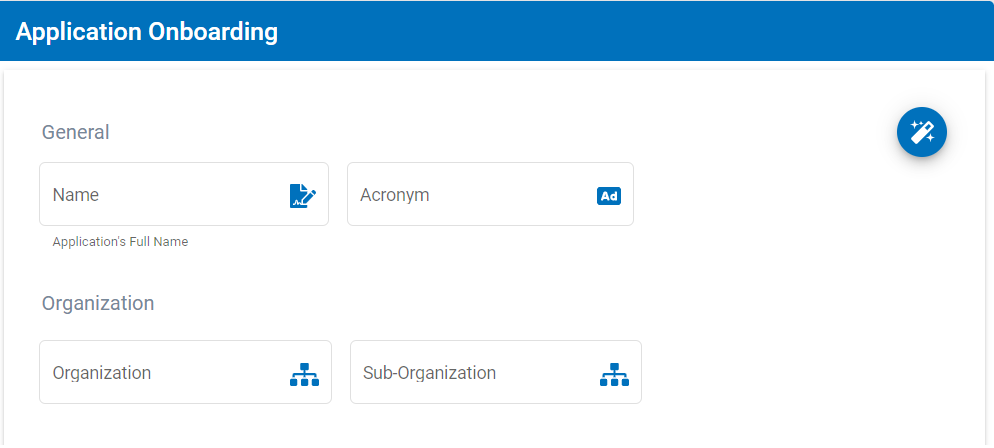
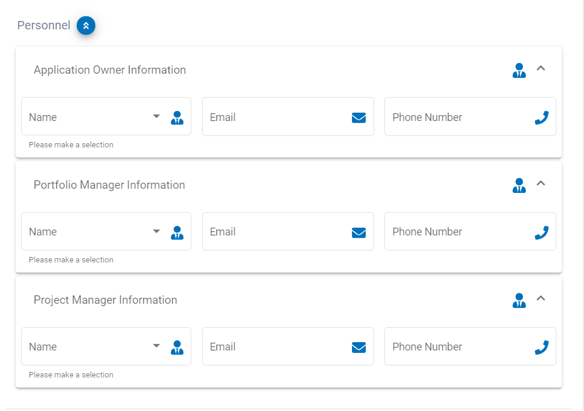
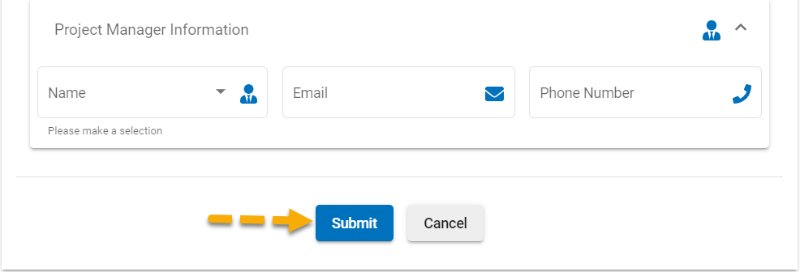
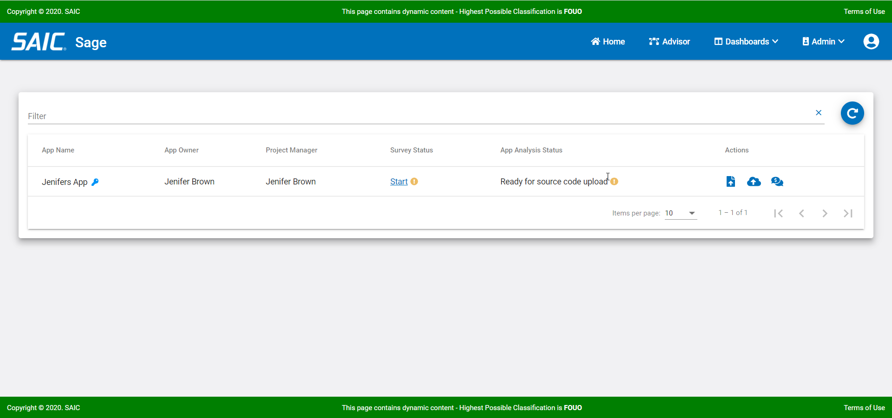

# Managing Your Applications

## Onboarding Your Application

Once you are logged into the Sage product you will need to onboard your application in order to process it. Please watch the following video for an overview of the onboarding process.  Step by step instructions follow the video.

*onboarding video here*

Now, you can follow these easy steps below to complete your application onboarding.

To begin, set up your appliccation information.

**1. Select the Application Onboarding Link located under the Admin drop down on the main menu bar.**

The Onboarding Page allows you to enter all the basic information for setting up your application within Sage.

:::note

The Application Name, acroynm, organizaion name, and application owner are all required fields.

:::

**2. Enter your application name, its acroynm, your organizaion name and optionally your sub-organization name.**

**3. Enter the Application Owner information (required) and any other applicable personnel fields.**

**4. Select Submit at the bottom of the page to proceed.**

Once you have completed the set up of your application, you should see it listed in your home screen.

:::tip

You can use the Filter option above the list of applications to search for your specific application. You can search using the application name, acronym, or even the application identification number.

:::

Now that you have entered your information, it's time to upload your application source code.

**5. Select the Upload Source Code Icon**

*Screenshot here*

**6. Upload your zipped up source code**

*Screenshot here*

:::important
Zipped up source code files cannot exceed 500MB.  If your application source code is larger than 500MB, it will need to be split apart and zipped up into logical blocks that are smaller than 500MB and then you will need to follow the entire onboarding process for each zip file.
:::

Now that you have successfully uploaded your source code, it's time to upload any artifacts, documents, charts, graphs, testing results, etc that you may want to include with your application

**7. Select the Upload Artifacts Icon if you have any artifacts to include**

*Screenshot here*

**8. Upload any application artifacts or documents**

*Screenshot here*

### Issues with your Application Onboarding?

Please refer to our Sage Operations Guide for troubleshooting tips.
*Link to Operations Guide*

## Survey Management 

In order to provide you with the most accurate Cloud readiness anaylysis, you need to complete a short survey with questions regarding your application and its dependencies and interfaces.  Please be sure to provide the most accurate information as possible as incorrect answers can affect your output.

Please watch the following video for a quick overview of completing the survey.

*Video Here*

Now, follow these steps to complete your survey:

**1. Select the Survey Icon**

*Screenshot here*

**2. Answer all the survey questions**

*Screenshot here*

:::important
Survey answers need to be as accurate as possible.  Seek out the assistance of your application software experts if you don't know the answers as incorrect survey values can affect your output.
:::

**3. Select OK**

*Screenshot here*

### Survey Question Details

|Survey Question| Possible Answers |Question Details or Examples|
|---------------|----------------|----------------|
|What is the system type|1. Legacy System  2. Cloud System|1. Non-Cloud Based System  2. Cloud Based System  |
|What is the architechture of the system?|Web System (3-Tier)  1. Thick Client System  2. Mainframe System|  |
|What is the data impact level of this system?|IL-2  IL-4<  IL-5  IL-6  IL-7|PUBLIC  CUI or Non-CUI  Higer Sensitivity CUI  SECRET  TOP SECRET|
|What type of primary interface is associated with this system?|1. HTTPS Based  2. Non-HTTPS Based  3. Rest  4. UDP, TCP, etc|
|How many primary interfaces are associated with this system?|0-20|Number of primary interfaces |
|What type of secondary interface is associated with this system?|1. HTTPS Based  2. Non-HTTPS Based  3. Rest  4. UDP, TCP, etc|
|How many secondary interfaces are associated with this system?|0-20|Number of secondary interfaces |
|What is the primary database type for this system?|1. Niche  2. Available Paas<  3. No Database| |
|How many primary databases are associated with this system?|0-20| |
|What primary database components are usedfor this system?|1. DB Links  2. Stored Procs  3. Both  4. None| |
|What is the secondary database type for this system?|1. Niche  2. Available Paas  3. No Database| |
|How many secondary databases are associated with this system?|0-20| |
|What secondary database components are usedfor this system?|1. DB Links  2. Stored Procs  3. Both  4. None| |
|Does this system use CAC for authentication?|Yes  No| |
|What user token does the system use?|1. SAML  2. JWT  3. Other|1. Security Assertions Markup Language  2. JSON Web Token  3. Anything else|
|Does the system use Shared Filesystems or Shared Caching?|Yes  No| |
|Does this system use messaging based products?|Yes  No|MQSeries, Apache Kafka, MuleSoft Anypoint Platform, RabbitMQ, and Apache ActiveMQ or others|
|Does this system have a need for real-time data syncronization?|Yes  No| |
|Does this system have use of Propietary Tools/ETL/BI/COTS products?|Yes  No| |

## Migration Metric and Data

### Application Assessment

### Application Technical Debt

### Application Cloud Readiness 

### Application Cost Estimate 

## Migration Estimate

In order to create your migration estimates, you will need to run the Migration Estimation tool on against your uploaded code results and completed survey.  Please watch the following viedo for a quick overview of running migration estimates.

*Video Here*

Peform the following steps to create your migration estimates.

1. Select the Migration Estimate Icon

*Screenshot here*

2. Select run

*Screenshot here*

3. Once the migration estimate is complete the report will be available....??
 
*Screenshot here*

## Dashboards

### CAST Highlight Dashboard 

### SonarQube Dashboard

### Metabase Dashboard